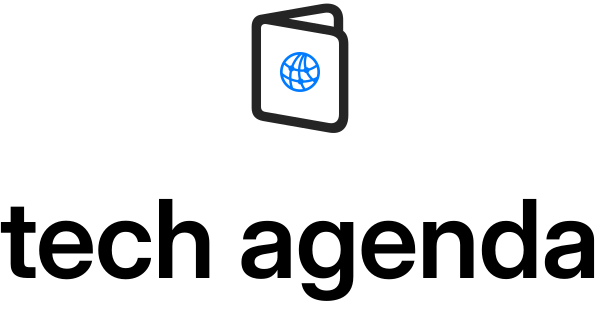

<div align="center">
  
  <h1>Tech Agenda</h1>
  <p>A agenda de eventos para o povo de tecnologia. 🇧🇷</p>
</div>

## O que é

A **Tech Agenda** é um projeto **open source** que centraliza eventos de tecnologia
que estão acontecendo ou prestes a acontecer — para você não perder mais aquela
inscrição que queria fazer. A ideia nasceu da frustração de não encontrar um lugar
ativo que reunisse essas informações: os que existiam estavam descontinuados.

Os eventos são organizados pelas áreas:

- 💻 **#DEV** — Desenvolvimento de software
- ⚙️ **#DEVOPS** — DevOps, engenharia de sistemas e infra
- 📦 **#PRODUCT** — Criação de produtos tech
- 🎨 **#DESIGN** — Design de produtos tech
- 👥 **#MGMT** — Gerenciamento de times tech

## Funcionalidades

- Listagem e busca de eventos por nome, cidade, tags, modalidade (online/presencial) e disponibilidade
- Página de detalhe de cada evento, com local no mapa e Call for Papers (CFP) quando houver
- Login social (OAuth) e perfil do usuário
- Confirmação de presença em eventos ("vou participar")
- Páginas de gestão para criar e administrar eventos

## Stack

| Camada | Tecnologia |
|--------|------------|
| Backend | Go 1.25, [Echo](https://echo.labstack.com/), [Uber fx](https://uber-go.github.io/fx/) (DI), [Cobra](https://cobra.dev/) (CLI) |
| Frontend | React 18 + TypeScript, renderizado via **SSR** com [go-react-ssr](https://github.com/natewong1313/go-react-ssr), Tailwind, PrimeReact, Leaflet (mapas) |
| Banco | PostgreSQL com [GORM](https://gorm.io/) e migrations via [goose](https://github.com/pressly/goose) |
| Auth | OAuth via [goth](https://github.com/markbates/goth), sessões em cookie e JWT (ED25519) |

> A UI **não** é uma SPA separada: o servidor Go renderiza o React e devolve HTML.
> Os tipos consumidos pelo frontend são gerados a partir das structs Go.

## Rodando localmente

Pré-requisitos: **Go 1.25+** e **Docker** (para o Postgres). O frontend precisa de **Node**.

```bash
# 1. Suba o Postgres
docker-compose up -d postgres

# 2. Instale as dependências da UI
cd ui && npm install && cd ..

# 3. Configure o ambiente (ajuste conforme necessário)
cp env.example .env.local

# 4. Instale as ferramentas auxiliares (goose, go-enum)
make install-deps

# 5. Rode as migrations
make migrate-up

# 6. Suba a aplicação (http://localhost:8000)
make run
```

Comandos úteis:

```bash
make new-migration migration=nome_da_migration   # cria uma migration
make migrate-status                               # status das migrations
make key-gen                                      # gera par de chaves ED25519 para o JWT
go test ./...                                     # roda os testes
golangci-lint run                                 # lint
```

## Estrutura do projeto

```
cmd/          Entrypoints da CLI (run, migrator, key-gen) — Cobra
lib/          Infra compartilhada: config, database, server (Echo), ssr, session, logger
pkg/          Módulos de domínio (event, user, venue, tag, cfp, attendee, oauth, ...)
migrations/   Migrations goose (em Go)
ui/           Frontend React/TypeScript (pages, components, organisms, molecules)
```

Cada módulo em `pkg/` é um módulo [fx](https://uber-go.github.io/fx/) (`fx.go`) com
suas camadas (`model`, `service`, `router`). Para entender a arquitetura em detalhe
— em especial o contrato Go↔TypeScript do SSR — veja o [`CLAUDE.md`](./CLAUDE.md).

## Contribuindo

A proposta é ser open source e **todo mundo é super bem-vindo a colaborar**. Para contribuir:

1. Faça um fork e crie uma branch a partir da `main`.
2. Garanta que `go build ./...` e `go test ./...` passam (toda mudança de código deve vir com teste cobrindo, ao menos de forma unitária).
3. Abra um Pull Request descrevendo a mudança.

## Licença

[MIT](./LICENSE) © Marco Ollivier
